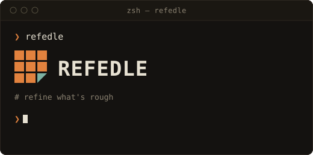

Refedle is a TUI-driven data transformation tool for CSV and JSON files, built with .NET 10 and Terminal.Gui v2. It lets you explore a file interactively, apply column-level transformations, and replay them as a recipe against large files from the command line.

## Supported Formats

| Format | TUI (Tree) | TUI (Table) | CLI batch (`--cli`) |
|---|---|---|---|
| CSV | — | ✅ | ✅ |
| JSON Lines (`.jsonl`) | ✅ | ✅ | ✅ |
| JSON Array | ✅ | not yet implemented | ❌ |
| JSON Object | ✅ (top-level only) | — | ❌ |

CLI batch mode currently accepts `.csv` and `.jsonl` only — standard `.json` (array/object) input is explicitly rejected (`NotSupportedException`). CSV ↔ JSON Lines conversion is supported in batch mode.

## TUI Usage

```bash
dotnet run --project src/App -- --file <path> [--recipe <path.yaml>]
```

Key bindings (`src/App/AppKeyHandler.cs`):

| Key | Action |
|---|---|
| `o` | Open file |
| `s` | Save recipe |
| `t` | Toggle Tree/Table view (JSON Lines only) |
| `x` | Column/row action menu |
| `c` | Clear action stack |
| `Backspace` | Back from drill-down |
| `?` | Help |
| `q` | Quit (confirms if there are unsaved actions) |

Column actions available from the action menu: Rename, Delete, Cast, Filter, Fill, Format Timestamp. Two drill-down modes exist: a single-node drill-down for JSON Object arrays, and a full-file aggregation drill-down for JSON Lines/Array.

## CLI Batch Usage

```bash
dotnet run --project src/App -- --cli --input <in.csv|in.jsonl> --recipe <recipe.yaml> --output <out.csv|out.jsonl>
```

Recipes are saved from the TUI as `.yaml` and applied here without opening the UI. Format dispatch (reader → transform → writer) is resolved at compile time via a source generator (`src/Generators/FormatDispatcherGenerator.cs`), not reflection.

## Project Structure

```
src/
  App/         TUI (Terminal.Gui v2) and CLI entry point (Program.cs, Cli/)
  Engine/      File I/O (mmap-backed), schema scanning, filtering, actions, recipe (de)serialization
  Generators/  Roslyn incremental source generator for format-agnostic dispatch
tests/
  Refedle.Tests/
docs/          Design documents
```

## Implementation Notes

- File reads use `System.IO.MemoryMappedFiles` with `ArrayPool<byte>` buffer reuse; CSV parsing is backed by the [Sep](https://github.com/nietras/Sep) library. There is no SIMD/vectorized scanning code in the engine at this time.
- Recipe YAML is a hand-written, AOT-safe reader/writer (no YamlDotNet or reflection-based serialization).
- Error handling favors a `Result`/`Result<T>` return type over exceptions on expected failure paths.
- Both `App` and `Engine` are configured for Native AOT (`PublishAot=true` / `IsAotCompatible=true`) with `TreatWarningsAsErrors` enabled.

## Requirements

- .NET SDK 10.0.201+ (see [global.json](global.json))

## Build & Test

```bash
dotnet build
dotnet test
```

## Acknowledgements

Built with [Terminal.Gui](https://github.com/gui-cs/Terminal.Gui) and [Sep](https://github.com/nietras/Sep), both MIT licensed. See [THIRD-PARTY-NOTICES.txt](THIRD-PARTY-NOTICES.txt) for full license texts.

## License

[MIT](LICENSE)
